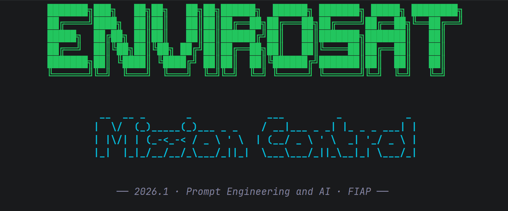
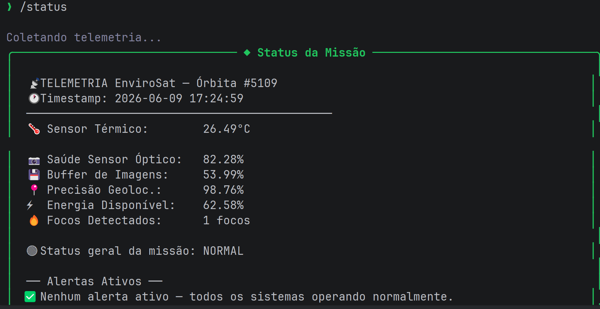

# EnviroSat — Mission Control AI

Sistema de monitoramento inteligente de missão espacial desenvolvido para a Global Solution 2026.1 da FIAP. O projeto simula a operação de um satélite de observação ambiental e usa IA generativa via Ollama Cloud pra interpretar os dados de telemetria em linguagem natural, conectando cada anomalia técnica ao impacto real no combate a incêndios e desmatamento no Brasil.

## Integrantes

Filipe Gunther – RM: 571131
Lucas Pinheiro - RM: 573497
Guilherme Guimarães - RM: 572957

Turma: 1CCR

## O que o projeto faz

O EnviroSat Mission Control AI monitora em tempo real os parâmetros de um satélite ambiental simulado: temperatura do sensor térmico, saúde do sensor óptico, buffer de imagens, precisão de geolocalização e energia disponível. Quando algum parâmetro sai do normal, o sistema dispara alertas com ações recomendadas e chama o modelo de linguagem pra explicar em linguagem natural o que aquilo significa pra quem tá na ponta — brigadas de combate a incêndio, analistas do INPE, operadores do centro de controle.

A IA não é decoração. Os dados reais de telemetria são injetados no prompt a cada consulta, então as respostas mudam dependendo do estado atual da missão.

## Persona atendida

Operador de centro de controle ambiental (INPE/órgão estadual) — a pessoa que precisa decidir, em segundos, se um alerta de foco de calor é confiável o suficiente pra acionar uma brigada. Pra essa persona, clareza vale mais que tecnicidade: o sistema entrega diagnóstico, ação recomendada e impacto terrestre em texto limpo.

## Tecnologias utilizadas

- Python 3.10+
- Ollama Cloud API (https://ollama.com) — modelo gpt-oss:120b
- ollama — cliente Python oficial
- python-dotenv — gerenciamento de credenciais via .env
- rich — interface terminal com painéis e formatação
- prompt_toolkit — input com histórico e estilização
- pyfiglet — banner ASCII

## Como executar

```bash
# 1. Clone o repositório
git clone https://github.com/seu-usuario/mission-control-ai.git
cd mission-control-ai

# 2. Crie e ative o ambiente virtual
python -m venv .venv
source .venv/bin/activate  # Linux/Mac
.venv\Scripts\activate     # Windows

# 3. Instale as dependências
pip install -r requirements.txt

# 4. Configure a chave da API
cp .env.example .env
# Edite o .env e coloque sua chave Ollama:
# OLLAMA_API_KEY=sua_chave_aqui

# 5. Execute
python main.py
```

## Demonstração





## System Prompt

O system prompt completo está em [prompts/system_prompt.md](prompts/system_prompt.md).

A ideia central foi dar uma persona bem definida pra IA — ARIA (Automated Response and Intelligence Analyst) — e instruir o modelo a sempre amarrar o dado técnico ao impacto no mundo real. Um sistema que detecta sensor térmico a 72 graus precisa traduzir isso pra "brigadas ficam sem dados confiáveis de foco de calor", não só jogar um número na tela.

## Cenários de teste demonstrados

1. Operação normal — todos os parâmetros dentro do range esperado
2. Incêndio em larga escala — alto número de focos com sensor térmico elevado
3. Energia crítica — falha nos painéis solares, modo emergência ativado
4. Falha múltipla — sensor óptico degradado, buffer cheio e geolocalização imprecisa ao mesmo tempo

Os cenários pré-definidos estão em data/cenarios.json. Durante a execução, o sistema gera telemetria aleatória com chance de anomalia a cada leitura, então cada sessão é diferente.

## Proposta de valor e modelo de negócio

**Problema real terrestre**

O Brasil perde milhões de hectares de vegetação nativa todo ano pra incêndios e desmatamento. Grande parte desses casos só é detectada quando já avançou demais, porque o monitoramento por satélite gera um volume absurdo de dados brutos que operadores humanos não conseguem processar em tempo real. O EnviroSat Mission Control AI resolve exatamente isso: transforma telemetria crua em diagnóstico acionável em segundos, permitindo que brigadas sejam acionadas antes que o incêndio saia de controle.

**Quem paga pela solução**

Modelo híbrido. Setor público (INPE, IBAMA, Secretarias Estaduais de Meio Ambiente) como contratante principal via licitação ou convênio federal, e setor privado (seguradoras agrícolas, cooperativas rurais, empresas de compensação de carbono) como clientes secundários que pagam pelo acesso à API de alertas.

**Métrica de impacto**

Se o EnviroSat-1 operar 100% saudável por 1 ano: aproximadamente 850.000 km² monitorados continuamente, com tempo de detecção de novos focos reduzido de horas para minutos. Isso se traduz em cerca de 300 a 500 acionamentos de brigada com coordenadas precisas por ano, comparado aos casos atuais onde brigadas chegam à região errada por imprecisão de geolocalização.

**Modelo de negócio**

SaaS de dado-como-serviço: assinatura mensal para acesso à plataforma de alertas com SLA de disponibilidade. Nível básico para órgãos públicos com recurso via fundo ambiental, e nível premium com API, histórico e análise personalizada por bioma para empresas privadas de agro e carbon credits.

## Limitações conhecidas

- A telemetria é simulada e os valores são aleatórios, sem refletir comportamento orbital real
- O modelo gpt-oss:120b pode ser inconsistente em cenários muito específicos; cada cenário foi rodado pelo menos 3 vezes e o system prompt foi ajustado pra estabilizar as respostas
- Não há persistência de sessão: o histórico de leituras existe só enquanto o programa tá rodando
- A interface é exclusivamente CLI, sem dashboard visual

## Vídeo de demonstração

[Assistir demonstração no YouTube](https://www.youtube.com/watch?v=SEU_ID_AQUI)

Configurado como "Não listado" no YouTube.
